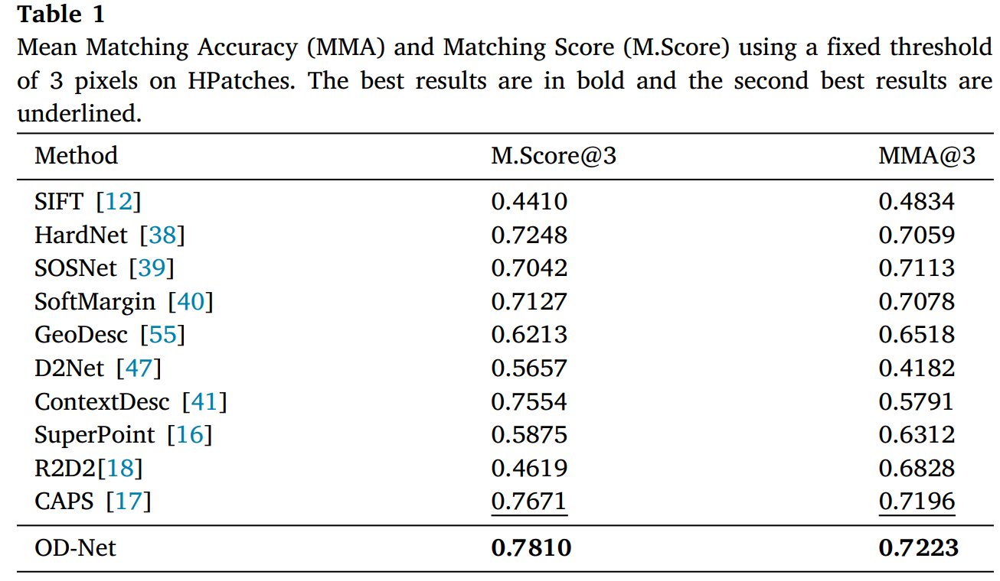

# OD-Net: Orthogonal descriptor network for multiview image keypoint matching

This repository contains a PyTorch implementation of the paper:

[*OD-Net: Orthogonal descriptor network for multiview image keypoint matching*]()
[[PDF]](https://www.sciencedirect.com/science/article/pii/S1566253523005225)

[Chun Fang], 
[Kun Sun](http://www.cv-kunsun.cn/),
[Xin Li],
[Kunqian Li],
[Wenbing Tao](http://faculty.hust.edu.cn/taowenbing/zh_CN/index/1485744/list/index.htm)


## Abstract

Learning robust feature descriptors from multiple views plays an important role in image matching and its downstream tasks. Due to various uncertainty factors from illumination to viewpoint, robust feature matching remains a challenging task; the generalization property of learned feature descriptors has also remained poorly understood. Our intuition is that ensemble learning can assemble a collection of feature descriptors by mining richer information for each pixel, which can lead to improved robustness and generalization properties. In this paper, we propose a new image feature description method named Orthogonal Descriptor Network (OD-Net), which describes a pixel by a multi-branch structure and then fuses them. To avoid the model being trapped into an ill-posed solution and encourage the network to mine complementary information, we have designed an orthogonality constraint and modeled it as a novel loss function. It is worth noting that the idea of orthogonal feature extraction is general and can be easily plugged into many existing frameworks. Extensive experiments have been carried out to show that our OD-Net can produce better results than the current state-of-the-art on a variety of image-matching tasks and evaluation metrics.

## Results
· The results of camera pose estimation on 3000 image pairs in the MegaDepth dataset.

· Mean Matching Accuracy (MMA) and Matching Score (M.Score) using a fixed threshold
of 3 pixels on HPatches.

· Rotation Estimation Accuracy (REA) and Translation Estimation Accuracy (TEA) on the NMNet dataset.

· Correspondences on some typical image pairs found by different methods.


## Requirements
```bash
# Create conda environment with torch 1.0.1 and CUDA 10.0
conda env create -f environment.yml
conda activate caps
```
If you encounter problems with OpenCV, try to uninstall your current opencv packages and reinstall them again
```bash
pip uninstall opencv-python
pip uninstall opencv-contrib-python
pip install opencv-python==3.4.2.17
pip install opencv-contrib-python==3.4.2.17
```

## Pretrained Model
The pretrained model is provided in [link](https://drive.google.com/file/d/15xvee-CqwTlpz9Cn4Ku4DSuBLCXALuCc/view?usp=drive_link). Please download it into pretrained/ for using.

## Dataset
Please download the preprocessed MegaDepth dataset using this [link](https://pan.baidu.com/share/init?surl=rGt4okK3KsumPLUVhOJdXQ). (password: 3na7)

## Training
To start training, please download our [training data](https://drive.google.com/file/d/1-o4TRLx6qm8ehQevV7nExmVJXfMxj657/view?usp=sharing), and run the following command: 

```bash
# example usage
python train.py --config configs/train_megadepth.yaml
```

## Cite
Please cite our work if you find it useful: 
```bibtex
@article{fang2023od,
  title={OD-Net: Orthogonal descriptor network for multiview image keypoint matching},
  author={Fang, Chun and Sun, Kun and Li, Xin and Li, Kunqian and Tao, Wenbing},
  journal={Information Fusion},
  pages={102206},
  year={2023},
  publisher={Elsevier}
}
```
**Acknowledgements**.
This code is built based on [CAPS](https://github.com/qianqianwang68/caps). We thank the authors for their useful source code.
